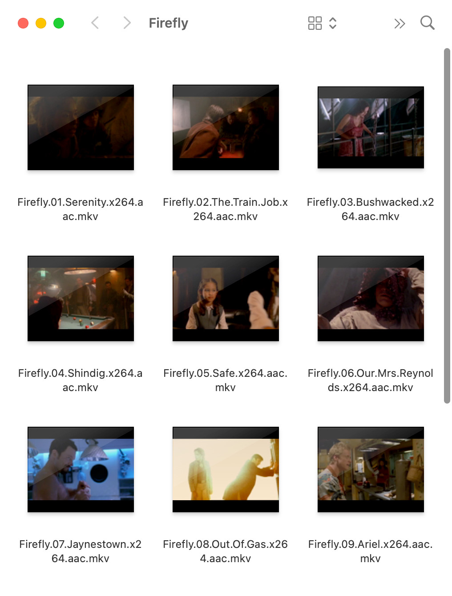

QuickLook Video
===============

This package allows OSX Finder to display thumbnails/cover art, static previews and metadata for most types of video files.

QuickLook and Spotlight on OSX 10.9 and later understand a limited number of media files - mostly only MPEG audio and video codecs within MPEG container files. This package adds support for wide range of other codecs and "non-native" media file types, including `.asf`, `.avi`, `.flv`, `.mkv`, `.rm`, `.webm`, `.wmf` etc.

 

Installation
------------
* Download the `.pkg` file (the green button) of the [latest release](https://github.com/Marginal/QLVideo/releases/latest).
* Double-click on it.
* The Installer app will walk you through the installation process.

Limitations
-----------
* To see thumbnails of video files you may need to relaunch Finder (ctrl-⌥-click on the Finder icon in the Dock and choose Relaunch) or log out and back in again.
* You may experience high CPU and disk usage for a few minutes after installation while Spotlight re-indexes all of your "non-native" audio and video files.
* The QuickLook "Preview" function displays a static snapshot of "non-native" video files.
* Interlaced content is sometimes not de-interlaced in QuickLook thumbnails and previews.
* Requires OSX 10.9 or later. Use [Perian](http://github.com/MaddTheSane/perian) for equivalent functionality under 10.8 and earlier.

Uninstall
---------
* Run the Terminal app (found in Applications → Utilities).
* Copy the following and paste into the Terminal app:

        sudo rm -rf "/Library/Application Support/QLVideo" "/Library/QuickLook/Video.qlgenerator" "/Library/Spotlight/Video.mdimporter"
* Press Enter.
* Type your password and press Enter.

Reporting bugs
--------------
* First, please check that you're running the [latest version](https://github.com/Marginal/QLVideo/releases/latest), log out of OSX and back in again and see if the problem remains.
* Open a [New issue](https://github.com/Marginal/QLVideo/issues/new) and describe the problem.
* To help diagnose the problem please run the Terminal app (found in Applications → Utilities) and type:

        qlmanage -m
        qlmanage -p -d1 /path/of/some/video/file
but substitute the *path of some video file* by dragging a video file from the Finder and dropping it on the Terminal window.
* In the Terminal app choose Edit → Select All then Edit → Copy, and paste the results in the "New issue".

Acknowledgements
----------------
Uses the [FFmpeg](https://www.ffmpeg.org/about.html) libraries.

Packaged using [Packages](http://s.sudre.free.fr/Software/Packages/about.html).

License
-------
Copyright © 2014 Jonathan Harris.

Licensed under the [GNU Public License (GPL)](http://www.gnu.org/licenses/gpl-2.0.html) version 2 or later.
