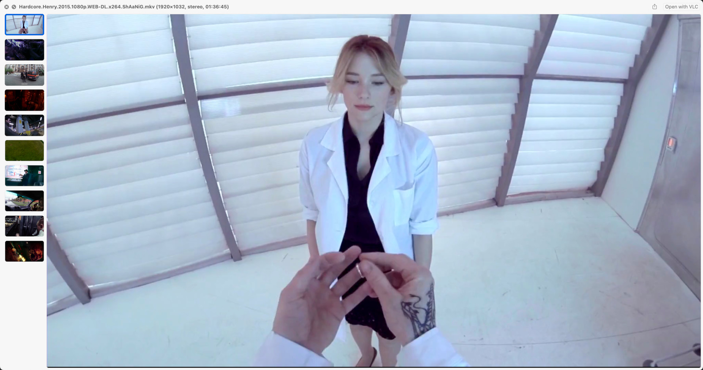

Quick Look Video
===============

This package allows macOS Finder to display thumbnails, static previews, cover art and metadata for most types of video files.

QuickLook and Spotlight understand a limited number of media files - mostly only MPEG audio and video codecs within MPEG container files. This package adds support for wide range of other codecs and "non-native" media file types, including `.asf`, `.avi`, `.flv`, `.mkv`, `.rm`, `.webm`, `.wmf` etc.

 &nbsp; 

Installation and Usage
----------------------
See [Getting Started](https://github.com/Marginal/QLVideo/wiki/Getting-Started).

License
-------
Copyright © 2014-2022 Jonathan Harris.

Licensed under the [GNU Public License (GPL)](http://www.gnu.org/licenses/gpl-2.0.html) version 2 or later.
